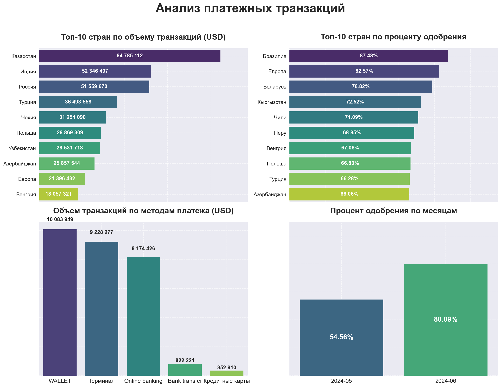

# Payment Analytics Dashboard

Аналитическая система для визуализации ключевых метрик платежных транзакций: объемы, процент одобрения, распределение по странам и методам платежей.

## 📌 Основные возможности

- **Автоматическая обработка** сырых транзакционных данных
- **Визуализация в 4 графиках**:
  - Топ-10 стран по объему транзакций
  - Топ-10 стран по проценту одобрения
  - Распределение по методам платежа
  - Динамика одобрений по месяцам
- **Экспорт результатов**:
  - Excel-отчет с детализированной статистикой
  - PNG-график для презентаций

## 🛠 Технологический стек

- **Язык**: Python 3.8+
- **Библиотеки**:
  - Обработка данных: `pandas`, `numpy`
  - Визуализация: `matplotlib`, `seaborn`
  - Excel-экспорт: `openpyxl`
- **Инструменты**:
  - Логирование: стандартный `logging`

## 🚀 Быстрый старт

### Установка

1. Клонируйте репозиторий:
   ```bash
   git clone https://github.com/Bidzhanova/payment_analytics.git
   cd payment_analytics
   ```

2. Создайте виртуальное окружение:
   ```bash
   python -m venv venv
   source venv/bin/activate  # Linux/Mac
   venv\Scripts\activate    # Windows
   ```

3. Установите зависимости:
   ```bash
   pip install -r requirements.txt
   ```

### Запуск анализа

1. Входные данные находятся в папке `raw/input.xlsx`
2. Запустите основной скрипт:
   ```bash
   python main.py
   ```
3. Результаты появятся в:
   - `results/output.xlsx` - детальная статистика
   - `results/plot.png` - комбинированный график

## 📊 Пример вывода

 <!-- Добавьте реальный пример в папку docs -->

> **Note**: Для кастомизации графиков редактируйте параметры в:
> - `config/plot_settings.py` - стили и цвета
> - `src/visualization.py` - расположение элементов
> - 